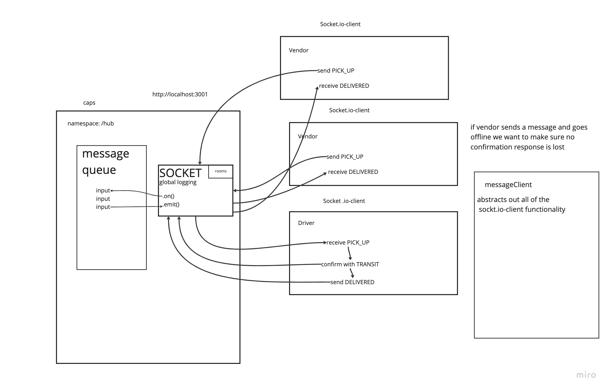

# LAB - Class 08

## Project: CAPS

### Author: Steven Rejdukowski

### Problem Domain

CAPS Phase 3: Begin the build of an application for a product called CAPS - The Code Academy Parcel Service. In this sprint, we’ll build out a system that emulates a real world supply chain. CAPS will simulate a delivery service where vendors (such a flower shops) will ship products using our delivery service and when our drivers deliver them, each vendor will be notified that their customers received what they purchased.

CAPS Phase 2: Continue working on a multi-day build of our delivery tracking system, creating an event observable over a network with Socket.io.

In this phase, we’ll be moving away from using Node Events for managing a pool of events, instead refactoring to using the Socket.io libraries. This allows communication between Server and Client applications.

The intent here is to build the data services that would drive a suite of applications where we can see pickups and deliveries in real-time.

### Links and Resources

- [ci/cd](https://github.com/Stevenrej/caps/actions) (GitHub Actions)

#### `.env` requirements (where applicable)

n/a

#### How to initialize/run your application (where applicable)

node server/index.js
node vendor/index.js
node vendor2/index.js
node driver/index.js

#### Features / Routes

runs all events in order

#### Tests

- How do you run tests?
  - npm test

- Any tests of note?
testing to make sure every event is being run

#### UML

#### Credit

-structure was edited after code review on 12/13/22
