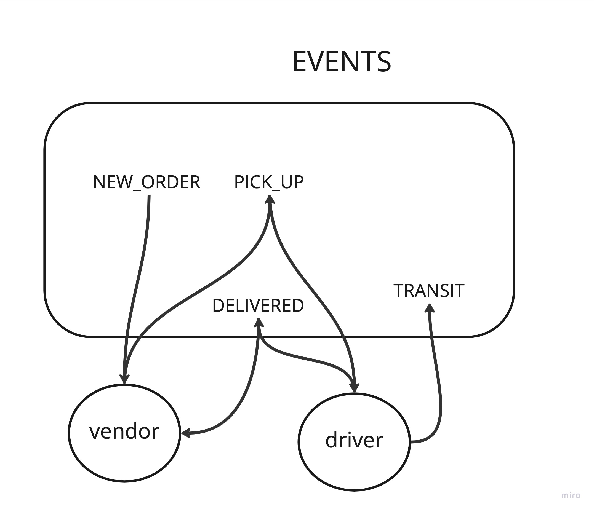

# LAB - Class 08

## Project: CAPS

### Author: Steven Rejdukowski

### Problem Domain

CAPS Phase 1: Begin the build of an application for a product called CAPS - The Code Academy Parcel Service. In this sprint, we’ll build out a system that emulates a real world supply chain. CAPS will simulate a delivery service where vendors (such a flower shops) will ship products using our delivery service and when our drivers deliver them, each vendor will be notified that their customers received what they purchased.

### Links and Resources

- [ci/cd](https://github.com/Stevenrej/caps/actions) (GitHub Actions)

#### `.env` requirements (where applicable)

n/a
#### How to initialize/run your application (where applicable)

node index.js

#### Features / Routes

runs all events in order

#### Tests

- How do you run tests?
  - npm test

- Any tests of note?
testing to make sure every event is being run

#### UML

